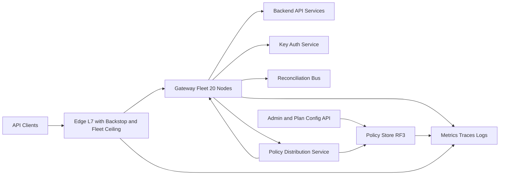
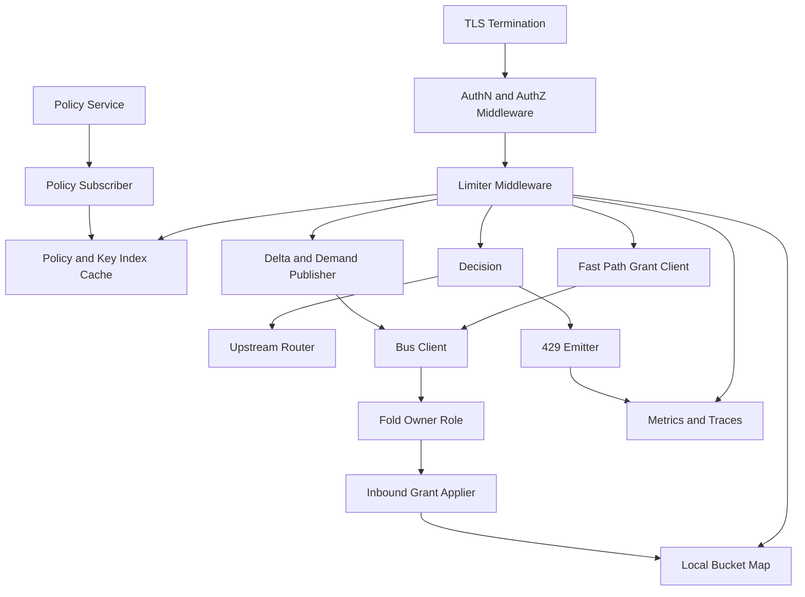

Depth: full — whole subsystem, hard latency invariant, a correctness bound, and a fail-open blast radius.

# Distributed Rate Limiter — Public API Gateway — Decision Package

## Executive Recommendation *

**Recommended:** enforce per-API-key limits with **demand-driven distributed credit leasing**. Each gateway node holds *leased credit* — a quantity of permitted requests for a `(key, window)` — and grants it on demand rather than being pre-seeded with a fixed fraction of the plan limit. A single **fold owner** per key shard, held by one of the 20 gateway nodes and selected as `hash(key_id, window_id) mod fleet_size`, is the only authority that issues credit, and it never issues more than the window's remaining unallocated allowance, so the fleet-wide invariant `sum(outstanding credit) ≤ window allowance` holds at all times. Every 25 ms each node publishes cumulative spend, current demand and its lease state; the fold owner sizes grants from advertised demand plus a headroom factor, and rebalances unspent credit away from nodes that are not using it. A node whose held credit is about to exhaust issues a fast-path grant request to the fold owner with a hard 1 ms deadline; if the deadline expires it denies. The decision path is otherwise a memory read, so the 2 ms added-p99 target is met by construction, and because no external tier sits in the decision path, "the limiter is unavailable" degenerates into "the node keeps enforcing with the credit it holds" rather than into an outage. Accuracy is bounded rather than hoped for: **over-admission ≤ 2%**, because a single owner grants the reserve and the allowance invariant caps total outstanding credit, and **under-admission ≤ one reconciliation round of demand redistribution**, which is 2.5% of a 1-second window and 0.04% of a 60-second window. The honest price is that the team owns a distributed leasing protocol with epoch fencing, and that the fast-path request is the one place the p99 budget can be touched; both are made explicit below with fenced epochs, idempotent grant semantics, and a measured ceiling on fast-path usage. **Recommended** the whole leasing mechanism is provisional until measured: P0 includes a decision gate that refutes or confirms the traffic shape it exists to serve (A55), and if refuted the v1 ships without the leasing protocol at a saving of roughly three weeks of the schedule.

## Requirements and Assumptions *

**Evidence state:** no system evidence is attached to this session and no reference library is loaded. Nothing in this document is **Verified** against a running system. Every line is your stated requirement, my arithmetic, or a labelled assumption. Attaching load-balancer per-second counters, plan configuration, and 429-related incident notes would raise the traffic and availability lines from assumed to verified.

**Labels in use:** **Stated** (your requirement, not verified in a running system), **Calculated** (derived here from visible inputs, formula shown), **Assumed (A#)** (temporary, with impact and validation trigger), **Recommended** (my judgement tied to a stated constraint), **Unknown** (requires investigation before commitment).

### Functional

| ID | Requirement | Label |
|---|---|---|
| F1 | Per-request rate enforcement on the public HTTP API, in the request path ahead of backends | **Stated** |
| F2 | Limits keyed by API key, values configurable per plan | **Stated** |
| F3 | Over-limit requests rejected with HTTP 429 plus `Retry-After` | **Stated** |
| F4 | Enforcement across 20 gateway nodes at ~50,000 req/s aggregate | **Stated** |
| F5 | Limiter unavailability fails open | **Stated** |
| F6 | Cross-node accuracy within ~5% | **Stated (target)** |
| F7 | Added p99 latency under 2 ms | **Stated (target)** |
| F8 | Config changes propagate within 30 s | **Assumed (A38)** |
| F9 | Coarse always-available per-key backstop floor beneath the accurate limiter | **Recommended (G6)** |
| F10 | Aggregate fleet admission ceiling, independent of per-key limits, enforced outside the limiter middleware | **Recommended** |
| F11 | Customer-visible degraded-mode signal on responses | **Recommended** |

### Non-goals

| ID | Non-goal | Label |
|---|---|---|
| N1 | Not a bot/DDoS/WAF layer; volumetric mitigation is upstream | **Assumed (A1)** |
| N2 | Not the billing-grade usage source of truth at 5% accuracy | **Assumed (A2)** — see X5 |
| N3 | Not authentication or authorisation; invalid key yields 401/403, never 429 | **Assumed (A3)** |
| N4 | Not a per-end-user quota system; one key = one enforcing principal | **Assumed (A4)** |
| N5 | No queueing, delaying or smoothing; only admit or 429 | **Assumed (A5)** |
| N6 | No cost or endpoint weighting; every request costs 1 | **Assumed (A6, A44)** |
| N7 | No cross-region enforcement in v1; single active region | **Assumed (A11)** |
| N8 | No customer-visible consumption analytics in v1 | **Assumed** — revisit if a usage dashboard is requested; a degraded-enforcement response header is in scope (F11) |

### Traffic

| ID | Value | Label |
|---|---|---|
| T1 | 50,000 req/s aggregate; 20 nodes | **Stated** |
| T2 | 2,500 req/s/node nominal; 2,778 at minimum fleet of 18 | **Calculated** |
| T3 | 50k/s treated as sustained peak; average 20,000 req/s | **Assumed (A7)** — 2.5× swing if wrong. Validation trigger: 30 days of per-second request counters **at the load balancer, not the gateway**, owner Gateway platform; A7 appears in Risks and Open Decisions |
| T4 | Peak-to-average 2–3×; bursts ≤ 10 s at up to 2× peak | **Assumed (A8)** — validation: p99.9 per-second counters plus client-side traffic synthesis |
| T5 | ~10⁵ active keys; top 0.1% (100 keys) carry ~30% of traffic; busiest key ~150 req/s | **Assumed (A9)** — validation trigger: 7-day per-key request distribution, owner Gateway platform; A9 appears in Risks and Open Decisions |
| T6 | Clients respect `Retry-After`; no retry amplification | **Assumed (A10)** — untested; protection specified in Failure Modes |
| T7 | Single region, one logical gateway fleet | **Assumed (A11)** — blocking question X4 |
| T8 | 4× growth over 24 months, ~200k req/s | **Assumed (A12)** |
| T9 | Fleet elastic 18–22 during deploys; invariant holds during membership change | **Assumed (A13)** |
| T10 | ~5,000 keys and ~10⁴ buckets per node; 640 KB bucket map | **Calculated** |
| T11 | 429 fraction ≈ 1% | **Assumed (A43)** — not in the original ledger; log volume has a 10× range without it |
| T12 | Connections are connection-pinned, i.e. a key's traffic may land on few nodes for minutes at a time | **Assumed (A55)** — the traffic shape that invalidated fixed-share seeding; validation trigger is P0 per-node-per-key concentration, and P0 carries a decision gate to downscope if refuted |

### Quality

| ID | Target | Label |
|---|---|---|
| Q1 | Added p99 ≤ 2 ms on the limiter path | **Stated** |
| Q2 | 2 ms is added gateway processing latency, not end-to-end | **Assumed (A15)** — blocking, sets the internal allowance; validation trigger and owner in Risks and Open Decisions |
| Q3 | Added p50 ≤ 0.1 ms, p95 ≤ 0.5 ms | **Assumed (A16)** |
| Q4 | No synchronous multi-hop coordination on the general request path | **Calculated** from Q1 + 2,778 req/s/node |
| Q5 | API 99.95%/month; enforcement 99.9%/month with fail-open absorbing limiter outages | **Assumed (A17)** |
| Q6 | Limit config durable RPO ≈ 0; counters ephemeral, losing ≤ one window acceptable | **Assumed (A18)** — blocking question X5 |
| Q7 | Per key per window: admitted ≤ limit + 5%, and spurious 429s ≤ 5% of allowance | **Recommended** — needs sign-off; see X2 |
| Q8 | Precedence when targets collide: latency, then fail-open, then accuracy | **Recommended (X1)** — confirm, it decides partition behaviour |
| Q9 | Two concurrent windows per key | **Assumed (A21)** |
| Q10 | Fixed windows per key with deterministic phase offset from wall clock; ≤ 50 ms fleet skew | **Assumed (A20, A45)** |
| Q11 | Accuracy invariant holds under single-node loss, staggered deploy and 10% fleet loss; not during a fleet-wide fold outage or a boundary-spanning outage | **Assumed (A22)** |
| Q12 | "Unavailable" = policy unreachable → last-known-good; local decision component failure → allow; negative verdict → always 429 | **Recommended (A23)** |
| Q13 | One hot key must not degrade other keys' accuracy or latency | **Assumed (A24)** |
| Q14 | Fast-path grant requests must stay under 0.5% of requests, or the p99 budget is at risk | **Assumed (A48)** — monitored, with an alert at 1% |

### Recovery

| ID | Requirement | Label |
|---|---|---|
| R1 | Config: RPO ≤ 0, RTO ≤ 5 min to restore enforcement after config-store loss, with a named restore procedure and a quarterly rehearsal | **Assumed (A25)** |
| R2 | Enforcement path: RTO unbounded by design; the real requirement is detection of unenforced traffic in < 2 min | **Assumed (A26)** / **Recommended** |
| R3 | Single-node loss: no operator action, no accuracy impact. ≥ 50% fleet loss: API stays up, enforceable state lost, detectable | **Assumed (A27)** |
| R4 | Recovery verified by probe, never by a component reporting its own health; a post-recovery probe asserts enforcement active on every node and leases re-converged | **Recommended** |
| R5 | A restarted node seeds zero credit and re-acquires through the fold owner; its pre-restart unspent credit is orphaned | **Assumed (A28)** |

### Constraints

| ID | Constraint | Label |
|---|---|---|
| C1 | No fixed budget stated; moderate cost sensitivity | **Assumed (A29)** |
| C2 | 2–4 backend engineers, general distributed experience, no dedicated SRE, no prior in-house limiter | **Assumed (A30)** — enforced as a scope cut in the Rollout Plan |
| C3 | GA within one quarter | **Assumed (A31)** — enforced as a scope cut | 
| C4 | Existing L7 gateway with pluggable middleware, an existing HA config service, a low-latency state/pub-sub tier, and a metrics/tracing pipeline | **Assumed (A32)** — highest-leverage unknown |
| C5 | 20 nodes, 50k req/s, single public API surface | **Stated** |
| C6 | Limiter load scales with request rate, not with backend health; no shared fate with backends | **Assumed (A33)** |
| C7 | Backstop floor and aggregate ceiling live in a layer with an independent failure domain from the limiter middleware | **Recommended (A54)** |

### Governance

| ID | Requirement | Label |
|---|---|---|
| G1 | API keys never appear cleartext in logs, metric labels or traces; version-prefixed keyed hash only | **Recommended (A34)** |
| G2 | A key may map to a natural person; per-key buckets and 429 events are personal-data-adjacent | **Assumed (A35)** |
| G3 | Pinned retention: buckets and reports memory-only; 429/limit events 30 days; config audit 13 months | **Assumed (A36, A50)** |
| G4 | Single-region only; any second region is a deployment-blocking gate, not a silent default | **Assumed (A37, X4)** |
| G5 | Every plan/limit change audited with principal, timestamp, old and new value, 13 months queryable | **Recommended** |
| G6 | Fail-open creates an unbounded-load and unbounded-spend exposure; bounded by the aggregate ceiling, not by per-key limits | **Recommended** — resolves the F5-versus-abuse-prevention conflict |
| G7 | Hash-key rotation must not orphan throttling history inside its retention period; erasure and subject-access must be answerable | **Recommended (A53)** |

### Unresolved blocking questions

**X1 Recommended** — confirm target precedence (Q8). **X2 Unknown** — what 5% is measured against and which error direction is worse. **X3 Unknown** — window semantics, permitted burst size, `Retry-After` meaning. **X4 Unknown** — regional topology. **X5 Unknown** — counter durability and any billing-grade requirement; the only question that changes the architecture rather than a parameter.

**A39 —** T = 25 ms round; grants sized from advertised demand plus headroom. Impact: under-admission is bounded by one round of demand redistribution rather than by a permanent share deficit. Validation: staging load test with synthetic bursty and connection-pinned keys.
**A40 —** R = 2% of each key's window allowance is held unallocated, granted only by the fold owner for fast-path requests. Impact: over-admission ≤ 2% while the single-owner rule holds. Validation: adversarial simulation, all nodes bursting one key simultaneously.
**A41 —** the reconciliation channel is an existing low-latency at-least-once bus, scopable to key-shard topics; measured RTT ≤ 1 ms. Impact: if absent, this design's operational burden equals Option B's. Validation: A32.
**A42 —** `Retry-After` is an integer, and for waits under 1 s it is `0` with a millisecond companion header. Impact: without this a sub-second window cannot be expressed and clients idle up to 40× too long. Validation: HTTP conformance check on the 429 path.
**A43 —** 429 fraction ≈ 1%. Impact: 429 log volume is 8.64 GB/day and ~0.26 TB at 30 days, so the cost lever is retention days rather than bytes; at a 10× higher 429 rate it would be ~2.6 TB and retention becomes a sizing decision. Validation: access-log sampling in P0.
**A44 —** every request of a key costs 1 unit. Impact: a cost-weight dimension changes the accounting key and the grant arithmetic.
**A45 —** per-key window phase offset = `hash(key_id) mod W`, deterministic and identical on all nodes, derived from wall clock, never from a monotonic clock. Impact: removes the boundary retry herd.
**A46 —** deploys are staggered so no more than 3 of 20 nodes restart within one window. Impact: restart orphaning is bounded per node. Validation: deploy tooling.
**A47 —** demand advertisement includes a headroom factor h = 1.25. Impact: affects grant efficiency only, never over-admission, because grants are capped by the allowance invariant. Validation: P2 fast-path utilisation test.
**A48 —** fast-path grant requests stay under 0.5% of requests, alert at 1%. Impact: above 1% the p99 budget is exposed. Validation: continuous monitoring from P2.
**A49 —** aggregate fleet admission ceiling = min(1.5 × peak, backend tested capacity); 1.5 × 50,000 = 75,000 req/s provisional. Impact: bounds fail-open exposure. Validation: backend saturation curve, see A52.
**A50 —** pinned retention: buckets and reports memory-only, life = one window plus two rounds; limit events 30 days; config audit 13 months.
**A51 —** bus RTT ≤ 1 ms; fast-path deadline 1 ms hard.
**A52 —** backend saturation knee — **Unknown**; the ceiling cannot be set correctly without it. Impact: the exposure bound is provisional. Validation: a backend load-to-failure test before P3.
**A53 —** hashed key ids are version-prefixed; the old hash key version is retained for the full retention period of the events it covers, then destroyed.
**A54 —** the backstop floor and fleet ceiling are implemented in a layer surviving limiter middleware failure — either a gateway-level pre-module with its own process or an edge L7 rule — not inside the limiter.
**A55 —** connections are pinned to nodes for minutes at a time, so per-key traffic is unevenly distributed. Impact: this is why credit is demand-driven rather than pre-allocated. Validation: P0 concentration measurement, with a decision gate.
**A56 —** the grant and report envelopes are the only source of admission credit, so a forged grant is indistinguishable from a legitimate one unless the path is authenticated. Impact: the grant path is a control plane and requires mTLS and strict schema rejection. Validation: security review before P2.
**A57 —** tenant isolation is per-key and per-backstop, but fold shards are shared hardware, so hard isolation of accuracy and latency depends on top-K isolation working. Impact: a hot key on a shared shard can delay folding for co-tenant keys if top-K isolation fails. Validation: P2 hot-key test asserting p99 fold age for non-top-K keys stays under 2 rounds.

## Capacity Calculations *

All figures are **order-of-magnitude sanity checks derived from the assumptions above, not benchmarks and not measurements of your system.**

| # | Quantity | Formula | Result | Implication |
|---|---|---|---|---|
| 1 | Peak aggregate | stated | 50,000 req/s **Calculated** | Input, not derived |
| 2 | Average load | peak ÷ 2.5 | 20,000 req/s **Calculated** | Basis for daily volume |
| 3 | Per-node peak | aggregate ÷ fleet | 2,500 nominal, 2,778 at 18 nodes **Calculated** | Size for 2,778 |
| 4 | Design point per node | per-node × burst 2× × 1.3 headroom | 2,777.8 × 2 × 1.3 = 7,222 req/s **Calculated** | ~2.9× mean; the safety margin is the procurement basis |
| 5 | Burst absorption | 100,000 × 10 s | 10⁶ requests, 5,000 req/s/node **Calculated** | Must be absorbed without fleet-wide coordination |
| 6 | Counter evaluations | peak × 2 windows | 100,000/s fleet, 5,000/s/node **Calculated** | Forces in-process decisions |
| 7 | Daily / monthly requests | average × 86,400; × 30 | 1.73 × 10⁹/day, 5.18 × 10¹⁰/month **Calculated** | Modest; input to the durability stress case |
| 8 | Bucket state | 10⁵ ÷ 20 × 2 × 64 B | 5,000 keys, 10⁴ buckets, 640 KB per node **Calculated** | Constrains nothing |
| 9 | Policy size | plans × bytes per plan | 50 × 200 B = 10 KB per node **Calculated** | Limits are per plan, not per key; the policy is kilobytes |
| 10 | Key to plan index | keys × 32 B | 10⁵ × 32 = 3.2 MB/node; 12.8 MB at 4× **Calculated** | This is the largest per-node structure and was previously unaccounted |
| 11 | Per-node memory total | buckets + index + policy | 640 KB + 3.2 MB + 10 KB ≈ 3.9 MB/node; 2.56 MB + 12.8 MB + 10 KB ≈ 15.4 MB at 4× **Calculated** | Comfortable, with a hard LRU cap on the bucket map |
| 12 | Durable counters, if X5 says yes | 12.8 MB × 1,440 windows/day | 18.4 GB/day, 6.73 TB/yr, 20,000 writes/s avg, 50,000/s peak **Calculated** | The strongest quantitative argument for ephemeral counters |
| 13 | 429 event log | 500/s × 200 B × 86,400 | 8.64 GB/day; **0.26 TB at 30 days** **Calculated** on an **Unknown** 429 rate | Retention days are the cost lever, not bytes; at a 10% 429 rate this is 2.6 TB |
| 14 | Config and audit | 10⁵ × 100 B; 10³ × 500 B × 365 | 10 MB config, ~0.18 GB/yr audit **Calculated** | Fully replicable to every node for free |
| 15 | Coordination volume | req/s × 64 B, independent of T | 3.2 MB/s, 25.6 Mbps, 8.29 TB/month **Calculated** | Never the binding constraint |
| 16 | Message count at T = 25 ms | fleet × 1/T | 20 × 40 = 800 batches/s, 4 KB each **Calculated** | T trades message count, never bytes |
| 17 | Fast-path grant requests | requests × p99-hit fraction | ≤ 0.5% × 50,000 = 250/s at peak **Calculated** on A48 | Tiny volume, but each carries a 1 ms held-time |
| 18 | In-flight requests at the p99 budget | Little's Law L = λW | 2,777.8 × 0.002 = 5.6/node **Calculated** | Most binding number in the package |
| 19 | Fast-path in-flight occupancy | 250/s × 1 ms ÷ 20 nodes | 0.0125 concurrent/node **Calculated** | Negligible in aggregate; the risk is the individual request's 1 ms |
| 20 | Pooled outbound connections | fleet × 2–4 | 40–80, plus 380 logical bus peers **Calculated** | No connection pressure |
| 21 | Config replication | 10 MB × RF 3 | 30 MB, quorum 2 of 3 **Calculated** | Durability is free at this size |
| 22 | Coordination at 4× × burst × safety | 3.2 × 4 × 2 × 1.5 | 38.4 MB/s **Calculated** | Under 40 MB/s with every multiplier applied |
| 23 | Client connections | not derivable | **Unknown** — no keep-alive or concurrency input in the ledger | 10× spread; belongs in requirements |
| 24 | Fail-open exposure, per-key only | backstop × plan_limit × keys | 2 × 1,000 × 10⁵ = 2 × 10⁸ req/s against 50,000 capacity = **4,000× capacity**; 0.1% of keys abusive = 100 × 2,000 = 200,000 req/s = **4× capacity** **Calculated** | A per-key backstop is insufficient; it needs the aggregate ceiling |
| 25 | Fail-open exposure with ceiling | min(1.5 × peak, backend tested capacity) | ≤ 75,000 req/s provisional, bounded by A52 **Calculated / Unknown** | Exposure becomes bounded by backend capacity, which must be measured |
| 26 | Monthly cost, normal load | nodes × unit + bus + logs | **20 nodes × $200–400/node-month = $4k–8k/mo** if nodes are provisioned for the limiter; **$0–300/mo incremental** if it rides existing gateway capacity **Assumed (A29, A32)** | The two figures answer different questions — provisioned versus incremental — and are not alternatives to each other |
| 27 | Monthly cost, failover load | surviving fleet carries full traffic | Node count unchanged at 10+ nodes; autoscale headroom ≤ **+30%**; 4× growth stays under the 38.4 MB/s coordination point **Calculated** | Failover needs no new capacity until the fleet drops below ~7 nodes |
| 28 | Monthly cost, enforcement outage | 429 egress and log volume to ~0, admission rises to the ceiling | Limiter cost ≈ unchanged; exposure is **downstream backend compute up to the ceiling** **Calculated** | The cost of a fail-open event is a backend cost, which is why A52 must be measured |

**Accuracy budget.**

- **Over-admission.** Formula: `over = credit granted beyond remaining allowance + reserve contention`. Under the single-owner rule, reserve can only be granted by `hash(key_id, window_id) mod fleet_size`, so reserve contention is structurally impossible and the allowance invariant caps total outstanding credit. **Calculated:** over-admission ≈ 0 at steady state and ≤ R = **2%** in the worst case where a boundary-spanning fold outage forces a re-grant the owner has not yet observed; the owner withholds grants from unobserved nodes for one round, bounding the residual to one round of reserve.
- **Under-admission.** Formula: `under = demand redistribution lag + fast-path deadline misses`. Grants are sized from advertised demand, so a connection-pinned client converges to its full allowance within one round instead of being capped at a fixed fraction. **Calculated:** lag ≤ T ÷ W = 25 ms ÷ 1,000 ms = **2.5%** for a 1-second window, and 25 ms ÷ 60 s = **0.04%** for a 60-second window, plus fast-path deadline misses below 0.5% of requests (A48). Total ≤ **3%** against the 5% ceiling, with the previous 93% deficit for a pinned client removed entirely.
- **Restart.** Formula: `restart under-admission = orphaned held credit ≤ 1/fleet of the window allowance`; `restart over-admission = 0`. **Calculated:** ≤ **5% under-admission per restarted node, 0 over-admission**, because a restarted node seeds zero credit and cannot reclaim orphaned credit, and because the allowance invariant is never exceeded by a returning node. This single rule replaces the previously contradictory 100% and 15% figures.
- **Implication:** the error is one-sided toward spurious 429s, the support-ticket direction, unless X2 resolves the other way — in which case set R = 0 and the reserve becomes a pure fast-path buffer with no over-grant capacity.

## Architecture *

### Context view

**Recommended** the limiter sits after authentication in the middleware chain, so an invalid key never reaches the limiter and never produces a 429 (N3). The backstop floor and aggregate ceiling sit in the edge layer with an independent failure domain (A54), so a limiter crash loop cannot disable them.

### Container view — one gateway node

**Component notes.** *Local bucket map:* one bucket per active key per window holding lease size, local spend, remaining credit, the highest sequence seen per peer, and a self-grant flag. Hard-capped by LRU at 50,000 buckets per node, evicting only zero-credit buckets and reloading authoritatively on next sight. *Fold owner role:* one of the 20 nodes holds the grant authority for each key shard, selected by `hash(key_id, window_id) mod fleet_size`; it is a role, not a tier, and every node runs the code. It is the only issuer of credit, including the reserve, and therefore the only writer of the allocation ledger for its shards. *Fast path grant client:* issues a bounded request with a hard 1 ms deadline when held credit is nearly exhausted; on expiry it denies. *Inbound grant applier:* applies grants idempotently by `(key_id, window_id, grant_seq)`. *Concurrency model:* **Recommended** bucket mutation uses per-bucket atomics with no shared lock on the decision path — the request path performs an atomic compare-and-decrement against the bucket's remaining credit, and the grant applier publishes grants as whole-bucket replacements ordered by `grant_seq`, so a grant is a monotonic increase in credit that never requires the request path to block. **Calculated:** a map-level lock would put fold latency directly into p99, which the 5.6-request in-flight budget cannot absorb, so a global lock is excluded structurally.

## Request and Event Flows

### Critical read path — admission decision

1. Request arrives; TLS terminated; key authenticated and resolved to a version-prefixed hashed key id; invalid key short-circuits to 401 before the limiter (N3).
2. Limiter computes the key's window id from wall-clock time with the per-key phase offset (A45) and looks up the bucket. Miss → insert an empty bucket; on first sight of a key within a window the node requests credit rather than granting itself a fixed share.
3. Atomic compare against remaining credit across both windows. If credit suffices, decrement and admit.
4. If credit is exhausted and the fast path has not already been taken this round, issue a fast-path grant request to the fold owner with a hard 1 ms deadline, then re-evaluate. If the deadline expires, deny — the local limiter is available, so this is a genuine over-limit verdict (A23), not a fail-open case.
5. Deny path: emit 429 with `Retry-After` computed to the maximum boundary across **all configured windows that could deny**, not only the ones that did; for waits under 1 s emit `Retry-After: 0` plus `X-RateLimit-Reset-Ms`; minimum integer 1 otherwise. The body names the denying window and a correlation id, and never the limit. If enforcement is degraded, add `X-RateLimit-Degraded: true` (F11).
6. No lock, no allocation, no network call on the common path.

### Critical write path — reconciliation round

1. Every 25 ms each node publishes, for keys it holds or touched: `{key_id, window_id, node_epoch, seq, cumulative_spend, demand, held_credit, self_grant}`. Cumulative counts, not deltas.
2. The fold owner for each shard merges by `(key_id, window_id, node_epoch)` with max-sequence-wins **within an epoch** and **sums across live epochs**, so a restarted node's new lower cumulative count is added, not discarded.
3. The owner recomputes allocations: total allowance for the window, credit currently outstanding, per-node advertised demand. It grants credit sized from demand times headroom h (A47), and rebalances unspent credit away from nodes that have not spent it. **Invariant enforced here:** `sum(outstanding credit) ≤ window allowance` at all times, including reserve.
4. Reserve is released at most once per key per window, only by the owner, only from the unallocated pool.
5. Node epochs are reaped at window rollover plus two rounds; a dead epoch's orphaned credit returns to the pool at rollover, never mid-window.
6. A node absent for a round is withheld from grants for one full round after it reappears, so the owner never double-grants against an unobserved self-grant.

### Failure path — fold owner unreachable

1. The decision path is unaffected while the node holds credit; this is the point of the design.
2. After **2 missed rounds (50 ms)**, nodes stop requesting fast-path grants and stop expecting rebalancing. Held credit is consumed normally.
3. A node may **self-renew a lease it already holds at the same size**, one round at a time, without coordinator contact. This is safe because renewal does not increase `sum(outstanding credit)`.
4. At a **window boundary with no fold contact**, each node may self-grant exactly `1/fleet` of the policy-known allowance for that key, and must set the `self_grant` flag in every subsequent report. The fold owner, on return, withholds grants from any node whose self-grant it has not yet observed for one full round, bounding the residual double-grant to one round of reserve.
5. After **30 s**, nodes enter degraded mode: no self-renewal beyond held credit, `enforcement_degraded` fires, `X-RateLimit-Degraded` is set on responses, and the edge ceiling (F10) becomes the binding bound.
6. Detection is independent of the accurate path: `reconciliation_freshness_p99` and `reports_received_per_node_per_round` both alert, at < 2 min (R2).
7. Recovery is verified by probe — every node's fold age under one round, grant authority confirmed for every shard, and lease totals reconciling to the allowance — not by the bus reporting healthy.

## Data Model and Ownership

| Entity | Key and shape | Access pattern | Owner |
|---|---|---|---|
| `LimitPolicy` | `(plan_id, window_kind)` → limit, burst allowance, backstop multiple, schema_version | ~50 plans, 10 KB per node fully cached; written by admin only, propagation ≤ 30 s | Policy service, single writer |
| `KeyIndex` | `hashed_key_id` → `(plan_id, flags)`, version-prefixed hash | 10⁵ entries, 3.2 MB per node, read on every request, LRU-capped with authoritative reload | Policy service, single writer |
| `Bucket` | `(key_id, window_id)` local to a node → lease size, local spend, remaining credit, peer_seq, self_grant | 5,000 evaluations/s/node, read-modify-write via per-bucket atomics; one issuing owner per bucket | Hosting node; credit issued by fold owner |
| `AllocationLedger` | `(key_id, window_id)` in the fold owner's memory → total allowance, outstanding credit per node, reserve pool, grant_seq | Written 800/s fleet-wide for the shards a node owns; single writer per key | Fold owner for that shard |
| `SpendReport` | `(key_id, window_id, node_epoch, seq)` → cumulative_spend, demand, held_credit, self_grant | Published 800/s, idempotent merge, memory-only, two-round life | Publishing node |
| `ConfigAudit` | `(timestamp, principal, plan_id, field)` → old, new | Append-only, 13 months queryable (G5) | Admin API |
| `LimitEvent` | `(ts, hashed_key_id, window_kind, verdict, retry_after, degraded)` | ~500/s append, 30 days, aggregated before storage | Observability pipeline |

**Partition key and hot-key analysis.** The bucket map is partitioned by `key_id` alone, and each bucket has exactly one credit-issuing owner, which is why no cross-node transaction or shared lock exists in the hot path. **Calculated** busiest-key load (A9): 150 req/s ÷ 20 nodes = 7.5 req/s/node of local work, which is nothing. The concentration risk is entirely in the **fold**, where the busiest keys generate the most report traffic and the most grant arbitration: the fold owner for a hot shard serialises ~7.5 grants/s plus merges across 20 peer reports per round, well inside a 25 ms round. **Recommended** fold shards are assigned so a hot key's fold work is owned by one node rather than performed by all twenty, and top-K isolation prevents a single key from delaying folding for others (Q13), verified by asserting p99 fold age for non-top-K keys under 2 rounds during a hot-key event.

**Retention, evolution and backfill.** Buckets and reports are memory-only, life = one window plus two rounds (A50). Limit events are the only durable artefact at request granularity, retained 30 days, aggregated thereafter. The report envelope carries a schema version and must tolerate unknown fields; a node must accept reports from a peer running one release older for the duration of a staggered deploy. Adding a window kind is additive; changing window *semantics* is breaking and requires a dual-run period computing both schemes and enforcing one. **Backfill:** none for counters — nothing is stored. Backfill applies to policy only: derive each key's limits from the current plan table, validate against 30 days of traffic to confirm no key would be newly throttled, and stage the result as a reviewable artefact before activation.

## Interface Contracts

### Synchronous API

| Concern | Specification |
|---|---|
| Client authentication | Performed before the limiter; the limiter consumes a resolved hashed key id. Invalid or missing credential yields 401/403, never 429 (N3, **Assumed A3**) |
| Key identity form | Version-prefixed keyed hash in all limiter state, logs, metric labels and traces; raw key never leaves the auth layer (G1, G7) |
| Authorisation | The limiter is a policy enforcer, not an authZ decider. An unknown key id within the limiter means an upstream bug; the safe default is the free-tier limit, never unlimited |
| Tenant context | key_id → account_id → plan_id; plan changes propagate within 30 s (**Assumed A38**) |
| Audit principal | Config changes carry the admin principal into `ConfigAudit` (G5). Enforcement decisions carry no user principal |
| Verdict contract | Admit or deny in memory. If the local limiter is not evaluable, admit subject to the backstop and ceiling; if the limiter is evaluable and over limit, deny — never fail open on a negative verdict (A23) |
| Validation | Policy schema validated at write time: limit ≥ 1, window in supported set, backstop multiple ≥ 1, plan exists. Invalid config is rejected at the API, never at the edge |
| Idempotency | Config reads are idempotent. Admission verdicts are **not** idempotent and must not be treated as such: a retried admitted request consumes another unit and can cause a later false 429 for that key. Reconciliation and grant messages are idempotent by construction |
| Transaction boundary | One atomic per-bucket decrement per key per window, and one single-writer grant decision per key per shard. No cross-key, cross-node or cross-window transaction exists |
| Errors | 429 with `Retry-After`; the limiter never emits 5xx, expressing internal failure as admission. The 429 body carries the denying window, a correlation id and a degraded flag — never the limit |
| Versioning | Policy schema, report envelope and grant envelope are versioned independently; nodes must run N and N−1 concurrently through a staggered deploy |
| Compatibility | Adding a window kind is additive. Changing window semantics or the meaning of `Retry-After` is breaking and needs a documented deprecation window |

**Retry safety, stated plainly.** *Safe to retry:* policy fetches, report publication, grant requests, and a 429'd client request after its `Retry-After` has elapsed. *Consumes capacity again, so a retry repeats it:* any admitted request — the one place where duplicate execution has a resource consequence, and why T6 is load-bearing. *Cannot duplicate a financial outcome:* nothing, because the limiter never charges, reserves or grants entitlement — **unless X5 resolves as billing-grade counters, at which point report and grant idempotency becomes an invoicing correctness requirement and the epoch-aware merge becomes mandatory rather than merely good practice.**

### Asynchronous streams

| Stream | Delivery semantics | Correctness | Lifecycle | Operations |
|---|---|---|---|---|
| Spend and demand reports, node → bus → fold owner | At-least-once, ordered per publisher per topic, no global ordering | Idempotency key `(key_id, window_id, node_epoch, seq)`; ordering scope per publisher; max-sequence-wins **within an epoch**, **summed across live epochs**; dedupe by sequence, never by timestamp; no transaction linkage — reports are after the fact, never a commit protocol | Memory-only, two-round life; replay safe and expected after a gap; deletion is TTL-driven, nothing to redact | Lag objective: p99 fold age ≤ 2 rounds, 50 ms; alert on freshness breach, on any node absent from a round, and on sequence gaps. **Poison-message runbook:** a report that fails to parse or names an unknown key is dropped with a counter, never retried forever; if drops exceed 0.1% of reports for a shard, the fold owner suspends reserve release for that shard and alerts, because unparseable reports mean unaccounted spend |
| Grant instructions, fold owner → bus → owning node | At-least-once, ordered per owner per shard | Idempotency key `(key_id, window_id, grant_seq)`; ordering scope per owner; applied as monotonic credit replacement; dedupe by `grant_seq`; transaction linkage is none — a lost grant causes a fast-path retry, never an inconsistency | Two-round life; replay is safe and is the recovery mechanism after owner failover; nothing to redact | Lag objective: grant age ≤ 1 round; alert if fast-path utilisation exceeds 1% of requests. **Poison-message runbook:** an unapplied grant leaves the node on held credit and it re-requests through the fast path; a malformed grant is dropped and counted, and three consecutive drops for one shard demote the owner role for that shard to a peer |
| Reserve-release decisions | Single-writer, emitted once per key per window by the owner | Ownership is structural — only `hash(key_id, window_id) mod fleet_size` may claim; safe to retry and idempotent by `grant_seq`; **atomicity:** the owner decrements the pool and increments the grant in one in-memory step, and a crash between report and grant loses the grant, which the node then re-requests | Lives only for its window; replay after owner failover is expected and safe | Alert if reserve utilisation for any shard exceeds 50% of the pool in a window, which indicates chronic under-granting rather than normal burst absorption |
| Policy distribution, service → nodes | At-least-once with monotonic versions, last-writer-wins | Idempotency by `(plan_id, config_version)`; ordering per plan; a node never applies a lower version | Retained with 13 months of audit history; replay is a first-class rollback mechanism | Lag objective: 30 s propagation (A38); alert if any node holds a version older than 60 s. **Runbook:** on a bad config, publish the previous version, then probe every node's applied version — do not trust the publish response |

## Alternatives Considered *

| Option | Fit to constraints | Cost | Operational burden | Verdict |
|---|---|---|---|---|
| **A-fixed** Fixed fair-share seeding with batched reconciliation | Meets p99 and fail-open by construction, but caps a connection-pinned client at 1/fleet + reserve = 5% + 2% = **7% of its plan**, so F6 fails for the normal client shape (A55) | ~$0–300/mo incremental | Low-moderate | **Rejected as a default** — an accuracy defect for pinned traffic; retained as the v1 fallback if P0 refutes A55 |
| **A′ — chosen** Demand-driven distributed credit leasing, single owner per key shard | Meets p99 by construction on the common path with a bounded 1 ms fast path on under 0.5% of requests. Over-admission ≤ 2% by single-owner reserve; under-admission ≤ 1 round of redistribution, 2.5% at 1 s windows. Restart costs 0 over-admission | **Assumed (A29, A32)** ~$0–300/mo incremental if it rides existing gateway capacity; ~$4k–8k/mo attributed if 20 nodes are provisioned for it | Moderate. No new tier — the authority is a role on the existing fleet — but the team owns a leasing protocol with epochs, fencing and failover | **Winner, conditional on A55** |
| **B** Central quota leasing from a 3-node replicated allocator tier | Same hot-path latency profile and the same single-owner grant mechanism A′ absorbed. Provable one-sided error; fails open with a lease-expiry horizon | ~$600–1,200/mo, or ~$0 hosted on an existing HA tier; lease traffic 0.17 MB/s | Moderate. One new replicated tier plus lease lifecycle, expiry and renew semantics, and an independent thing to page on | **Strong second.** Wins if A32 proves there is no usable bus, or if the team would rather operate a small replicated service than a protocol role |
| **C** Consistent-hash key owner with micro-batched synchronous evaluation | **Fails the hard constraint.** A 1 ms batch wait plus round trip consumes 50–75% of the 2 ms budget before load, and Little's Law says in-flight occupancy rises with held time | Infrastructure small; cost is engineering time, the scarcest input per A30/C2 | High. Sharded stateful service with rebalancing plus gateway-side coalescing | **Rejected on latency.** Revisit only if X5 demands durable, auditable counters, in which case the latency budget must be renegotiated upward |

**Why the winner won, and what would flip it.** A′ beats B on a narrow, decisive axis: **the grant authority is a role on hardware that already exists and already has a definition of "healthy".** B's accuracy is inherently the same, because A′ adopted B's single-owner grant mechanism; the difference is whether the single writer is a role on the gateway fleet or a dedicated tier with its own deployment, upgrade and page-out-of-hours story. With 2–4 engineers, no dedicated SRE and one quarter (C2, C3), a new tier is the thing most likely to become the incident, so the trade is a more complex protocol inside a fleet the team already operates. A-fixed is not a straw man and is not discarded: it was the original design, it fails F6 only *for pinned traffic*, and it remains the v1 design if P0 shows traffic is evenly spread — in which case a 1/fleet share is arithmetically correct and the leasing protocol has no work to do. All four options share the node-side enforcement core, so the decision is cheap to defer until the coordination layer is written and expensive after.

| Flip condition | New outcome |
|---|---|
| X5 resolves as durable or billing-grade counters | **C**, with the latency budget renegotiated upward |
| A32 proves there is no usable low-latency bus | **B** becomes cheaper than A′ |
| X2 resolves as "over-admission must be exactly zero" | Set R = 0 in A′; the reserve becomes a pure fast-path buffer with no over-grant capacity |
| **P0 refutes A55 — traffic is evenly spread across the fleet** | **Ship A-fixed and drop the leasing protocol for v1**, saving roughly three weeks; a 1/fleet share is exactly right for uniform traffic, so the 7% defect does not arise |
| Customer traffic proves dominated by sub-second bursts from few keys | **B**, or A′ at T ≤ 10 ms with a larger reserve |
| Fleet grows beyond ~40 nodes | **B** — A′'s fold fan-out and cold-start bounds both scale with fleet size |
| Added-latency budget renegotiated above ~5 ms | **C** becomes viable |

## Failure Modes and Recovery *

| Failure | Expected behaviour | Detection signal | Protection | Recovery, and how it is verified | Owner |
|---|---|---|---|---|---|
| Reconciliation bus partition | Enforcement continues on held credit; self-renewal keeps the invariant intact; drift is toward under-admission | `reconciliation_freshness_p99` > 2 rounds; `reports_received_per_node_per_round` shows absent peers | No bus in the common decision path; per-bucket atomics decouple the fold; invariant preserved by renewal-at-same-size | Bus recovery resumes folding automatically; **verified** by probe asserting fold age < 1 round on every node and outstanding credit reconciling to the allowance | Gateway platform |
| Fold owner fails | Its shards have no grant authority: no new credit, no rebalancing, no reserve release. Nodes live on held credit and self-renewal until failover completes | Shard has no owner heartbeat for one round; report lag for the shard | Role reassignment at `hash(key_id, window_id) mod 20` recomputed with a shard generation number; nodes treat grants from the previous generation as non-authoritative; grants withheld from unobserved nodes for one round after failover | New owner reconstructs the ledger from two rounds of reports; **verified** by probe asserting every shard has a live owner, lease totals reconcile, and fast-path utilisation returns under 0.5% | Gateway platform |
| Grant double-issue across a failover | Two owners both grant, so `sum(credit)` could exceed the allowance | `grant_seq` regression or two generations observed in one window | Shard generation number in every grant; non-authoritative generations rejected; reserve claimed once per `(key, window)` | Self-healing within a round; **verified** by a fault-injection test that kills an owner mid-window and asserts fleet-summed admitted rate stays inside the allowance | Gateway platform |
| Single node lost mid-window | Its held credit is orphaned; that key's fleet allowance is transiently under-used | Node heartbeat, `node_epoch` expiry | Orphaned credit cannot be double-spent; it returns to the pool at rollover | Node returns with a new epoch and seeds zero until first fold; **verified** by asserting the new epoch appears and the key's admitted rate returns inside bound within two windows | Gateway platform |
| **Correlated: bus and policy service both down** | Enforcement continues on last-known-good policy and held credit; config changes stop | Both liveness signals plus `config_version_age` | Per-node policy and key-index cache holds every rule; nothing is fetched per request; the two capabilities are deliberately decoupled | Restore either component to regain that capability independently; **verified** by a drill killing both and asserting the API is unaffected and alerting fires under 2 min | SRE + Gateway platform |
| Limiter middleware crash loop | **No per-request limiter at all.** Exposure is bounded by the edge backstop and fleet ceiling, which live outside the middleware (A54), not by an in-process backstop, which would be dead | Crash counter, `enforcement_disabled`, and a probe asserting the middleware is in the request chain | Backstop floor and aggregate ceiling in the edge layer; global kill switch; ceiling provisionally 75,000 req/s, capped by backend tested capacity (A52, **Unknown**) | Restart or roll back the release; **verified** by probe asserting enforcement present on all 20 nodes and a synthetic over-limit key receiving 429 | Gateway platform, on-call |
| **Telemetry or operator access impaired** | You cannot see the failure and cannot change behaviour | Absence of expected metrics is itself the signal — alert on *missing* heartbeats, not on threshold breach | Out-of-band alerting path independent of the observability pipeline; kill switch reachable without the primary control plane, authorised by a named break-glass principal, logged to the audit trail with reason and timestamp | Re-establish one channel, then follow the runbook; **verified** by a quarterly drill disabling the primary pipeline and asserting alerts still arrive | SRE |
| **Retry amplification** — clients ignore `Retry-After` | A throttle becomes a load amplifier against a fleet already at 5.6 in-flight requests per node | 429 followed by a near-immediate retry from the same key in access logs; `429_then_retry_rate` SLI | Per-key hard ceiling in the edge backstop layer independent of the accurate path; `Retry-After: 0` plus millisecond header for sub-second windows so compliant clients need not idle; the fleet ceiling bounds the aggregate | Tighten the key's backstop or block the key via the admin path; **verified** by a synthetic client that ignores `Retry-After` and asserting fleet admission stays under the ceiling | Gateway platform |
| Hot-key fold congestion | Other keys' folding delayed | Fold latency per shard; top-K report rate | Fold sharded by key, top-K isolation; the hot key's own grants serialise, which is a property of single-owner correctness, not a defect | Shard rebalance; **verified** by asserting p99 fold age for non-top-K keys under 2 rounds during the event | Gateway platform |
| Clock skew across nodes | Window boundaries disagree, so nodes disagree on which bucket a request belongs to | Skew metric, cross-node boundary audit | Wall-clock-derived window id with ≤ 50 ms bounded skew plus per-key offset; monotonic clocks used only for interval and round measurement, never for window identity | NTP correction; **verified** by a boundary-consistency probe asserting all nodes agree on the window id for a sample of keys | SRE |
| Policy service outage | New limits cannot be published; existing enforcement continues | Liveness plus version age | Last-known-good cache; audit trail intact | Restore; **verified** by publishing a canary version and probing all nodes' applied version | API platform |
| Policy store loss | RPO ≈ 0 if replicated | Store liveness plus replica count | RF 3 across ≥ 2 availability zones, quorum 2 of 3, 30 MB stored | **Named procedure:** restore from a surviving replica into a staging cluster, verify config checksum against the last audited version, then promote; RTO ≤ 5 min; **verified** by a quarterly rehearsal restoring into staging and asserting all 20 nodes converge on the restored version | API platform + SRE |

**Recommended** three drills before GA and quarterly thereafter: bus partition, double-failure killing the bus and policy service together, and a limiter middleware crash loop with the edge backstop alone in the path. Recovery is verified by probe, never by a component reporting its own health.

## Security and Operability

**Trust boundaries:** client → edge (untrusted; TLS plus auth); edge → gateway (trusted network, mTLS recommended); gateway → bus (**control plane, not data plane**, **Assumed A56** — a forged grant is indistinguishable from a legitimate one unless authenticated, so the report and grant paths require mTLS, version-prefixed key ids and strict schema rejection rather than partial application); admin API → policy store (privileged, strong authN plus audit); gateway → observability (never carries raw keys); break-glass kill switch (separate credential, named principal, logged to audit with reason).

**Data classification and tenancy.** API keys are credentials and may be personal-data-adjacent (G2). Tenant isolation is implemented as per-key bucket isolation, per-key backstops and fold sharding. **Calculated:** a hostile tenant can consume its own allowance and add fold fan-out for its own keys. **Assumed (A57):** the guarantee that one tenant cannot affect another's accuracy or latency is *conditional* — fold shards are shared hardware, so it holds only while top-K isolation works; the validation trigger is the P2 hot-key test asserting p99 fold age for non-top-K keys stays under 2 rounds. **Calculated** tenant-isolated state: 10⁴ buckets per node at 10⁵ keys, rising to 4 × 10⁴ buckets × 64 B = **2.56 MB/node at 4× growth**, which remains trivial. Limits are configuration, not customer data, and are no longer disclosed in 429 bodies, so — **Calculated** from the interface contract that the 429 body "never [carries] the limit" — a stolen key can learn only its own account's limit and cannot fingerprint another plan's.

**Secrets, encryption, backups, supply chain, and the erasure-rotation interaction.** Key hashing uses a keyed hash with a **version prefix** (A53). Rotation adds a new version; the old version is retained for the full retention period of the events it covers and is then destroyed. That is what makes erasure and subject-access answerable: a request for a person's throttling history is served by hashing their known keys under each retained version and returning matching limit events, and an erasure is executed by deleting matching rows and recording the erasure in the audit trail. Configuration is encrypted at rest with rotation support. Backups cover policy and audit only — counters are deliberately not backed up, which must be stated in the DR documentation so it is not later "fixed". The new supply-chain dependencies are the bus client and the report and grant codecs; both need pinned versions and review, because the grant envelope sits on the enforcement control plane and an unrecognised schema must be rejected outright rather than partially applied.

**SLIs, SLOs and alerts.**

| SLI | SLO | Alert and user impact |
|---|---|---|
| Added limiter latency p99 | ≤ 2 ms, 99.9% of 1-minute windows (Q1) | Page on breach — the stated user-visible contract |
| Added limiter latency p99.9 with fast path | ≤ 2 ms including fast-path requests | Page; the only path where the 1 ms deadline sits inside the budget, and why A48 caps fast-path usage |
| Fast-path utilisation | < 0.5% of requests, alert at 1% for 5 min (A48) | Page at 1%; above it the p99 budget is exposed |
| Reconciliation freshness p99 | ≤ 2 rounds, 50 ms, 99.5% of 5-minute windows | Ticket at 2 rounds, page at 30 s of staleness — accuracy is degrading silently |
| Report coverage per node per round | Every node present in every round | Page on any node absent for 2 consecutive rounds; without this, partial-coverage degradation is invisible to the freshness SLI |
| Accuracy canary | Synthetic key with a known limit driven from outside the fleet: over-admission ≤ 5% and zero spurious 429s within limit, continuously | Page on breach; the only live verification of F6, replacing a sampled audit |
| Spurious 429 rate | ≤ 5% of allowance on probes and canary | Page — a throttled customer within limit is a visible failure |
| Detection time of unenforced traffic | < 2 min (R2) | Page; the alert that exists because fail-open must not be a silent mode |
| Config propagation age | ≤ 30 s (A38) | Ticket at 60 s |
| 429-then-retry rate | Informational with a floor alarm | Dashboard plus a ticket above a defined floor; a rising 429 rate can be correct behaviour and must not page |

Metrics follow RED on the limiter path and USE on the bus. Traces propagate a correlation id and the hashed key id, never the raw key. **Recommended** one dashboard per SLO plus a single enforcement-health dashboard answering "is every node enforcing the right limits right now" in one glance — the dashboard an on-call engineer needs during a fail-open event. Ownership: gateway platform owns the limiter, the fold role and the bus; API platform owns policy, key index and audit; SRE owns alerting and drills; the edge team owns the backstop and ceiling. Cost monitoring tracks per-node compute, message count and log volume separately, with attention on message *count*, since T and the fast-path rate trade volume for accuracy.

## Evolution and Scaling Triggers *

| Trigger metric | Threshold | Observation window | Structural change it justifies |
|---|---|---|---|
| Added limiter latency p99 | > 1.5 ms | 5 min | Move folding off request goroutines, or shard the bucket map |
| Fast-path utilisation | > 1% of requests | 5 min | Raise headroom h (A47), shorten T, or move to Option B's dedicated grant tier |
| Fleet size | > 40 nodes | 7 days | Fold fan-out and epoch bounds scale with fleet; migrate to a dedicated allocator tier |
| Reconciliation message count | > 2,000/s fleet | 7 days | Raise T with larger grants, or report only demand changes rather than all held keys |
| Coordination volume | > 30 MB/s | 1 day | Scope bus topics per key shard instead of fleet-wide, or introduce a fold hierarchy |
| Active keys per node | > 5 × 10⁴ | 30 days | LRU cap begins evicting live buckets; shard the key index and revisit fold sharding |
| Key cardinality | > 10⁶ active | 30 days | Key index grows to 32 MB/node; move to a sharded index with authoritative reload |
| Config propagation age | > 15 s p99 | 7 days | Push-based distribution instead of pull |
| Sequence gaps or dropped reports | > 0.1% of reports | 1 day | Snapshot-fetch recovery instead of waiting for the next cumulative report |
| Over-admission ratio on canary | > 2% | 30 days | Tighten reserve toward 0, shorten T, or move to the dedicated grant tier |
| Reserve utilisation | > 50% of pool for one shard | 30 days | Reservations are chronically starved; resize the reserve or the grant policy |
| Traffic growth | 200k req/s (4×) | 90 days | Scale fleet; verify bus at 38.4 MB/s with every multiplier; no architecture change expected |
| Regions | any second active region | immediate | Everything changes: cross-region credit requires a consistency decision, and the 5% bound becomes a cross-region problem (X4) |

## Rollout Plan

**Recommended** v1 ships P0–P3 only. P4 and P5 are deferred to v1.1, because P0–P5 plus a parallel P4 does not fit 2–4 engineers in one quarter with no dedicated SRE (C2, C3). P4 — the self-serve config API — should be added back when plan changes exceed roughly 10 per week or when manual edits exceed a few per day and start consuming support time.

**P0 carries a downscope decision gate.** The leasing protocol exists to serve one traffic property: uneven, connection-pinned per-key distribution (A55). P0 measures it directly, and the result decides the architecture rather than merely informing tuning.

- **Refuted:** if the p95 of per-node-per-key concentration across keys is within 1.5× of the uniform expectation (keys ÷ fleet), traffic is evenly spread, a 1/fleet share is arithmetically correct, and A-fixed has no accuracy defect. **Then v1 ships without the leasing protocol** — no fold owner role, no fast-path grant client, no epochs — retaining a fixed fair share plus the reserve, which removes roughly three weeks from the schedule, removes the top technical risk (R1), and makes P2 a reconciliation-hardening phase rather than a leasing-hardening phase.
- **Confirmed:** if the concentration p95 exceeds 1.5× uniform, proceed with A′ as specified.
- **Owner and evidence:** Gateway platform, from P0 per-node-per-key measurement, reviewed with the same sign-off as the X2 and X3 decisions. The gate is recorded as a written decision with the measured distribution attached, not as an implicit judgement.

| Phase | Scope | Effort | Exit criteria | Rollback |
|---|---|---|---|---|
| P0 Instrumentation and shadow | Limiter computes and logs verdicts without enforcing; edge backstop and ceiling off; **per-node-per-key concentration measured, including the p95 ratio to uniform** | M, ~2 weeks | Verdicts present for all keys; predicted over- and under-admission measured against policy; added p99 under 0.3 ms; **A55 confirmed or refuted and the downscope decision recorded**; no key newly throttled without review | Remove the middleware from the chain |
| P1 Enforce one plan | Enforcement on a single low-traffic plan; T = 100 ms initially; leasing protocol if A55 was confirmed, fixed fair share if refuted | S, ~1 week | 429 rate matches prediction within 20%; zero support tickets; canary accuracy inside 5% | Per-plan config flag back to pass-through |
| P2 Leasing or reconciliation hardening | If leasing: T to 25 ms, epochs and fencing, fold-owner failover, reserve single-owner rule, simulation harness injecting duplication, reorder, partition, clock skew and mid-window restart. If downscoped: reconciliation correctness, hot-key isolation and reserve-ownership tests only | M, ~3 weeks | Unification and fault-injection tests produce no double counting and no credit beyond the allowance; owner-kill test keeps admitted rate inside bound; **concurrent-fold load test asserts p99 unchanged with folds running at peak traffic**; bus partition drill passes with API unaffected and alert under 2 min | Freeze at T = 100 ms with a conservative reserve and keep the wider bound |
| P3 Progressive fleet rollout | 1% → 10% → 50% → 100% of keys, with config handled via direct edits | M, ~2 weeks | Each step holds error budget, p99, p99.9 and fast-path utilisation under 0.5%; no shard without a live fold owner; canary green throughout | Per-step percentage back to previous value |
| P4 Self-serve config API, audit query and propagation SLO — **v1.1** | Config write path, validation, 13-month audit query, propagation SLO | M, ~3 weeks | Canary config version reaches all 20 nodes in under 30 s; audit query returns old and new values for every change | Revert to direct edits with the API in read-only mode |
| P5 Abuse playbook, kill switch and quarterly drills — **v1.1** | Backstop and ceiling tuned against measured backend capacity, operator runbook, break-glass kill switch | S, ~1 week | Synthetic key at 100× limit is capped even with the accurate path disabled; ceiling set from a measured backend saturation test rather than a provisional 1.5×; kill switch rehearsed | Disable the backstop; accurate path unchanged |

## Risks and Open Decisions *

| # | Risk or decision | Owner | Deadline or closing evidence |
|---|---|---|---|
| X2 | Definition of the 5% bound and which error direction is worse | Product + you | **Before P1.** The acceptance test; a "zero over-admission" answer is already supported by setting R = 0, so this no longer blocks the architecture, only the parameters |
| X3 | Window semantics, permitted burst size, `Retry-After` meaning | Product + you | **Before P1.** Sets T, the reserve, and the backend's worst-case spike |
| X5 | Counter durability and any billing-grade requirement | Finance + Product | **Before P3.** ADR-3 remains Proposed-blocked; a yes moves this to Option C and forces a latency-budget renegotiation |
| X4 | Regional topology | You | **Before P3.** Any second region invalidates the single-region accuracy bound; treat as a deployment-blocking gate with an interim rule of no second-region deployment until decided |
| X1 | Confirm the latency, then fail-open, then accuracy precedence | You + SRE | Before P2; defines partition behaviour |
| A7 | **Unknown whether 50k req/s is peak or average** — if it is the average, peak is 125,000 req/s and every sizing figure triples to quintuples | Gateway platform | **Before P0.** 30 days of per-second request counters from the load balancer, not the gateway. This is the single highest-leverage traffic input in the document and has no design-stage substitute |
| A9 | **Unknown whether key cardinality is ~10⁵ and whether the top 0.1% really carry 30%** — hot-key concentration drives fold sharding and the LRU cap | Gateway platform | **P0**, from 7-day per-key request distribution. Above 10⁶ active keys the key index and fold sharding change structurally |
| A15 | **Unknown which measurement point the 2 ms SLA is written against** — if it is end-to-end rather than added gateway processing, the internal allowance shrinks and the 1 ms fast-path deadline must be re-costed or removed | You + Product | **Before P1.** A one-line answer from the SLA owner closes it |
| A55 | **Assumed connection-pinned traffic** is the sole justification for the leasing protocol | Gateway platform | **P0**, via the downscope decision gate. If refuted, v1 ships A-fixed and this document's central mechanism is removed |
| A57 | Tenant isolation is conditional on top-K isolation working on shared fold shards | Gateway platform | **P2 hot-key test**, asserting p99 fold age for non-top-K keys stays under 2 rounds during a hot-key event |
| A32 | Whether the assumed gateway middleware, HA state, bus and telemetry actually exist, and whether bus RTT is ≤ 1 ms | You | **Before P0.** If the bus is absent or slow, the design re-scores against Option B |
| A52 | Backend saturation knee — **Unknown** | Backend team | **Before P3.** The aggregate ceiling (F10) cannot be set correctly without it; until then the 75,000 req/s figure is provisional and fail-open exposure is bounded only approximately |
| A48 | Whether fast-path utilisation can be held below 0.5% | Gateway platform | **P2 load test.** If not, the p99 budget needs renegotiating or headroom h must rise |
| A46 | Whether deploys can be staggered to ≤ 3 of 20 nodes per window | Release engineering | **Before P3.** If not, restart orphaning must be compensated by a larger window-rollover recombination |
| R1 | The leasing protocol with epoch fencing is the top technical risk: correctness bugs are distributed and hard to reproduce | Gateway platform | Mitigate with the P2 simulation harness, fault injection and the reconciliation audit job — or remove the risk entirely by shipping A-fixed if the P0 gate refutes A55 |
| R2 | The grant path is control-plane: a forged or corrupted grant suppresses enforcement | Security | **Before P2.** mTLS, schema rejection, shard generation numbers |
| R3 | A per-key backstop without the aggregate ceiling is a 4,000× exposure | Finance + SRE | **Before P0**, at minimum by shipping the ceiling in the edge layer even while the accurate path is in shadow |
| R4 | Retention was previously a range rather than a policy; 30 days and 13 months are now pinned but were not validated with privacy | Privacy + Legal | Before P1; extending either period requires a fresh review |
| R5 | The substrate behind the keyed-hash version scheme has not been reviewed against the organisation's erasure and subject-access procedure | Privacy + Legal | Before P1 |
| R6 | 429 fraction unknown (A43), so log volume carries a 10× range and 30-day retention is 0.26 TB at 1% but ~2.6 TB at 10% | Observability | P0, once real data exists |
| R7 | Deferred scope: P4 and P5 do not ship in v1, so operators change plans by direct edit and the abuse playbook starts manual | You | Accept before P0; re-open when plan-change volume exceeds ~10/week |
| R8 | T, headroom h and the reserve are live tuning parameters whose misadjustment silently moves accuracy | Gateway platform | Before P1; alert on the accuracy SLI and fast-path utilisation, not on the parameters themselves |

## Architecture Decision Records

**ADR-1 — Demand-driven distributed credit leasing with a single owner per key shard, conditional on measured traffic skew.**
*Context:* a 2 ms added-p99 budget at 2,778 req/s/node permits ~5.6 in-flight requests per node; fail-open and 5% accuracy must coexist; and if traffic is connection-pinned, a fixed fair share would cap a pinned client at 7% of its plan. *Decision:* each node holds leased credit acquired on demand; one fold owner per key shard, selected as `hash(key_id, window_id) mod fleet_size`, is the only issuer of credit including a 2% reserve; grants are sized from advertised demand times headroom; the invariant `sum(outstanding credit) ≤ window allowance` is enforced by that single writer; the common decision path is a memory read with a bounded 1 ms fast path taken by under 0.5% of requests. The decision is **conditional**: P0 measures per-node-per-key concentration, and if the p95 ratio to uniform is within 1.5×, the protocol is dropped from v1 in favour of a fixed 1/fleet share. *Status:* **Proposed — blocked on A55 measurement, X2 and X3.** X5 would supersede it. *Consequences:* p99 is met by construction on the common path, fail-open is a degradation rather than an outage, over-admission is bounded by reserve contention, under-admission by one round of demand redistribution, and the team owns a distributed leasing protocol with epochs and owner failover — a cost that is only paid if the P0 gate confirms it is needed. The fast path is the single place the latency budget can be touched, which is why its utilisation is a monitored SLO. *Alternatives rejected:* **fixed fair-share seeding** (structurally caps a pinned client at 1/fleet + reserve = 7%, failing F6 for pinned traffic — but retained as the v1 design if P0 shows traffic is uniform); **a dedicated replicated allocator tier (Option B)** (same grant mechanism, but a new tier to deploy, upgrade and page for, unjustified at 2–4 engineers with no SRE); **synchronous key-owner evaluation (Option C)** (fails the latency invariant outright, 1 ms batch plus round trip consuming 50–75% of the budget before load).

**ADR-2 — Cumulative counters with monotonic sequence, merged per epoch and summed across epochs.**
*Context:* the bus is at-least-once with no global ordering, and nodes restart. *Decision:* publish cumulative spend per `(key_id, window_id, node_epoch)` with a monotonic sequence; max-sequence-wins within an epoch and sum across live epochs; reap dead epochs at window rollover plus two rounds. *Status:* Accepted. *Consequences:* duplicates and reorders are harmless, a restarted node's lower cumulative count is added rather than discarded, and gap detection becomes possible; records are slightly larger and a gap requires a wait or a snapshot fetch. *Alternatives rejected:* additive deltas, which double count on the first duplicate; and a plain max-sequence merge over `(key, window, node_id)`, which permanently undercounts a restarted node.

**ADR-3 — Counters are ephemeral; losing one window is acceptable.**
*Context:* durable counters imply ~20,000 writes/s average and 6.73 TB/year. *Decision:* no durable counter store; only policy, key index and audit are durable. *Status:* **Proposed — blocked on X5.** *Consequences:* cheap and simple, and it is what makes Option C unnecessary; if usage is billed from this path the decision inverts and the design must move to single-writer-per-key durable accounting. *Alternatives rejected:* a durable counter store, which buys nothing the stated requirements ask for and costs an operational tier.

**ADR-4 — Fail open per request, bounded by a backstop floor and an aggregate ceiling outside the limiter middleware.**
*Context:* F5 and abuse prevention are in direct conflict, and a per-key backstop alone leaves a computed 4,000× exposure. *Decision:* fail open on any limiter-internal failure, always apply a coarse per-key local cap at a generous multiple of the plan limit, and additionally enforce an aggregate fleet admission ceiling in a layer with an independent failure domain that survives a limiter crash loop. *Status:* Accepted for the principle; the ceiling's value is blocked on A52. *Consequences:* fail-open is no longer a silent unlimited-traffic mode, exposure is bounded by the ceiling rather than by per-key arithmetic, and the backstop is deliberately inaccurate and generous. If the ceiling is ever enforced inside the limiter middleware, a crash loop disables both bounds and the design silently reverts to unbounded exposure — which is why A54 is stated as a constraint, not a preference. *Alternatives rejected:* fail-closed, which turns a limiter outage into an API outage; pure fail-open with only a per-key backstop, which is a 4,000× exposure.

**ADR-5 — Fixed windows per key with a wall-clock-derived phase offset.**
*Context:* aligned windows create a fleet-wide retry herd; a monotonic clock cannot produce a window id that 20 nodes agree on; and reconciliation keys on `(key_id, window_id)`. *Decision:* window identity is derived from wall clock with bounded ≤ 50 ms skew plus a per-key offset of `hash(key_id) mod W`, identical on every node; monotonic clocks are used only for interval and round measurement. *Status:* **Proposed — blocked on X3.** *Consequences:* the retry herd disappears and `Retry-After` stays honest, at the cost of per-key minute boundaries that do not align to the wall clock and boundary burst behaviour slightly more permissive than a sliding window. *Alternatives rejected:* globally aligned windows (retry herd); monotonic-clock window identity (incoherent across nodes, and it breaks the reconciliation key); sliding windows or per-request smoothing (materially more state per key for a bound the fixed window already meets).

**ADR-6 — `Retry-After` computed to the maximum boundary across all windows that could deny.**
*Context:* F3 requires `Retry-After`; a value computed only from the windows that denied sends clients straight into a second 429; and integer seconds cannot express a sub-second window. *Decision:* compute the wait to the maximum boundary across all configured windows that could deny; emit `Retry-After: 0` plus `X-RateLimit-Reset-Ms` when the wait is under 1 s, otherwise integer seconds with a minimum of 1; the body names the denying window and a correlation id, never the limit. *Status:* Accepted. *Consequences:* interoperable, self-diagnosing and honest about sub-second windows; depends on per-key offset windows (ADR-5) to avoid synchronised retries. *Alternatives rejected:* an HTTP-date `Retry-After`, which is legal but creates clock-skew disputes; a blanket minimum of 1 second, which idles sub-second-window clients up to 40× longer than necessary; omitting the header, which violates F3.

**ADR-7 — Hash key versions are retained for the retention period of the data they cover.**
*Context:* a keyed hash protects key ids, but rotation with immediate destruction of the old key would orphan throttling history, making erasure and subject-access requests unanswerable; the key-to-person mapping lives in the auth system rather than the limiter. *Decision:* hashed ids carry a version prefix; rotation adds a version without destroying the old one; an old version is destroyed only after the retention period of the events it covers has elapsed. *Status:* Accepted, pending privacy review (R5). *Consequences:* erasure is executable by hashing the subject's known keys under each retained version and deleting matching limit events, with the erasure recorded in the audit trail; the cost is that more than one hash key is live at a time, so the hash key material is itself a scoped, versioned secret with its own rotation and destruction audit. *Alternatives rejected:* single-key rotation with immediate destruction of the old key, which silently makes past events unattributable; and storing raw key ids, which violates G1.
